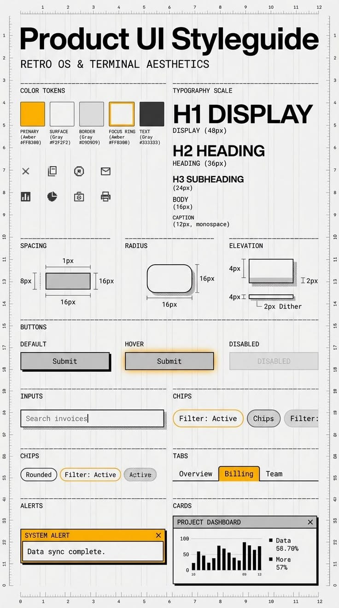

# Armasio 💾

**Armasio** è un'applicazione web in stile **Retro OS & Terminal Aesthetics** ideata per archiviare, gestire e organizzare il proprio guardaroba, diviso per diverse abitazioni: **Milano**, **Reggio** e **Sardegna**.

Il design del sito è ispirato alla seguente guida estetica retro:


## Caratteristiche Principali

- **Mini Menu di Navigazione**: Cambia rapidamente visualizzazione tra le tre case ("Milano", "Reggio", "Sardegna"). Ogni casa possiede il proprio database indipendente (salvato nel `localStorage` del browser).
- **Interfaccia Armadio Interattiva**:
  - Un armadio a 4 colonne disegnato con sottilissime linee di contorno (stile blueprint/disegno tecnico CAD).
  - Due coppie di ante a doppia finestra (sinistra per le colonne 1 e 2, destra per le colonne 3 e 4) apribili con transizioni CSS 3D fluide ed realistiche.
  - Apertura automatica delle ante alla selezione di un vano interno.
  - Visualizzazione in tempo reale del contenuto: appendiabiti con grucce colorate interattive e ripiani con pile di vestiti piegati.
- **Struttura dei Vani**:
  - **Colonna 1 (Sinistra Esterna)**: Ripiano superiore grande e 3 cassettoni nella parte inferiore (con animazione di scorrimento all'apertura).
  - **Colonna 2 (Sinistra Interna)**: Divisa a metà con due appendiabiti (classico appendiabiti sopra e sotto).
  - **Colonna 3 (Destra Interna)**: Zona appendiabiti centrale (tutta altezza).
  - **Colonna 4 (Destra Esterna)**: 4 ripiani spaziosi per capi piegati.
- **Pannello Ispettore CAD**:
  - Seleziona un vano per visualizzarne l'inventario in dettaglio.
  - Aggiungi nuovi capi con nome, marca, note e selezione colore (inclusa palette retro e selettore colore personalizzato).
  - Elimina capi con un click.
  - Statistiche in tempo reale per tipologia di capo per ogni casa.
- **Aesthetic Retro**:
  - Coordinate millimetriche/righelli (ruler) dinamici ai bordi superiore e sinistro della finestra (stile CAD/blueprint).
  - Finestra stile sistema operativo classico con barre del titolo scure, pulsanti di controllo e ombre 3D solide (`4px 4px 0px #333`).
  - Dither pattern pixel-art per texture e sfondi retro.

## Come Eseguire Localmente

L'applicazione è sviluppata interamente in vanilla **HTML5**, **CSS3** e **JavaScript** (ES6), senza dipendenze esterne.

Puoi avviarla utilizzando il server locale integrato in Python:

```bash
python3 -m http.server 8000
```

Dopodiché, apri il browser all'indirizzo:
[http://localhost:8000](http://localhost:8000)

## Repository GitHub

La repository è pubblicata su GitHub all'indirizzo:
[https://github.com/LukePalmDev/Armasio](https://github.com/LukePalmDev/Armasio)
